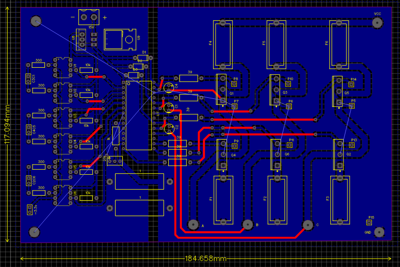
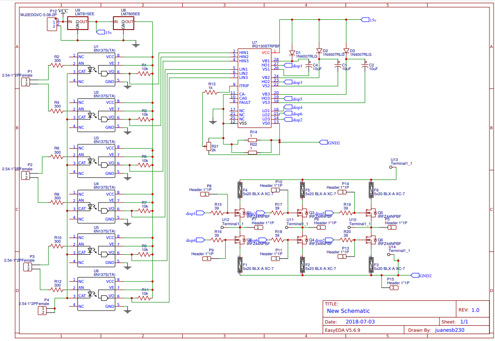
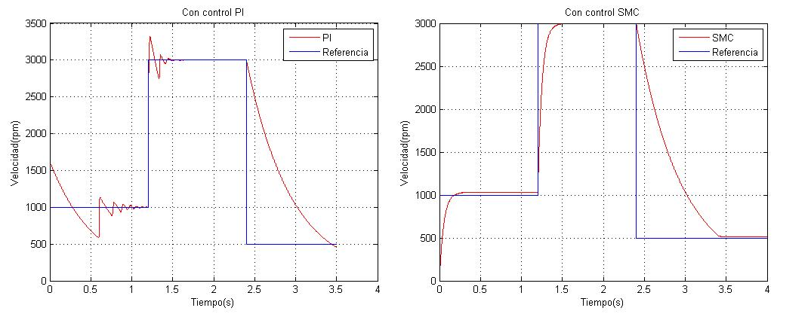
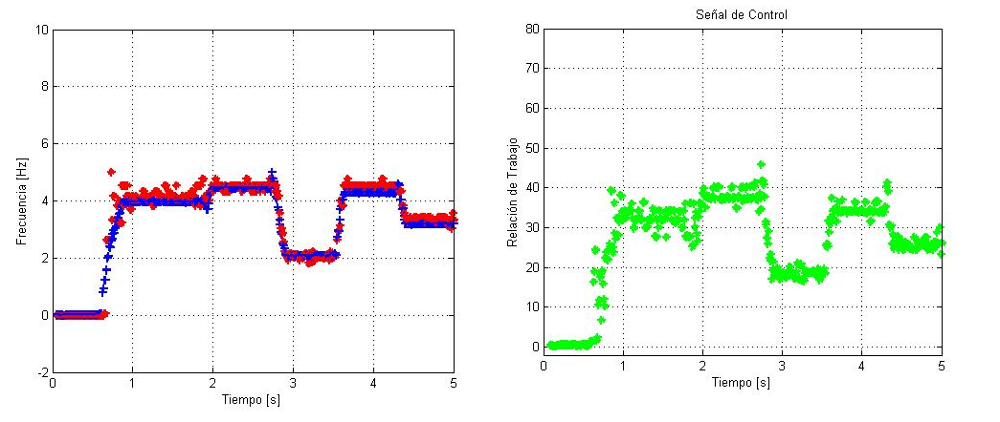

# SMC velocity control of brushless DC motor
<!-- markdownlint-disable MD033 -->
<!-- markdownlint-disable MD047 -->
## 1. Prerequisites

Have installed on your computer MATLAB, STM32ST-Link, waijung for programming STM32 in MATLAB.

## 2. Materials used

-Mosfets

-6N137

-Driver IR2130

-USB RobotDyn

-Microcontroller Discovery STM32F4

-Voltage Regulator 7805

-Brushless DC Motor

-Optical encoder

## 3. PBC

You can have the PBC fields in the Design folder in PDF format, as can see in the next figure:

  

The schematic the following figure is in the Design folder.

  

## 3. Description

The STM32F4 has the SMC speed control, this microcontroller recives the Hall efect sensors signals of motor Brushless and the digital value of optical encoder and sends PWM signals to inversor.

The Table shows the connection pines of STM32.

| PIN | Description |
| --- | --- |
| A6 | PWM mosfet Q1 |
| A8 | PWM mosfet Q2 |
| A2 | PWM mosfet Q3 |
| A1 | PWM mosfet Q4 |
| A0 | PWM mosfet Q5 |
| B6 | PWM mosfet Q6 |
| PD0 | Hall Sensor coil A |
| PD1 | Hall Sensor coil B |
| PD2 | Hall Sensor coil C |
| C7 | Optical encoder signal |
| C0 | Potenciometer (velocity reference) |
| PD8/PD9 | UART Serial comunication |

It is very important to know the ignition sequence of the different motor coils.The following Table you can see the ignition sequence of Brushless motor that I use it.

| Hall Sensor coil A |  Hall sensor coil B | Hall sensor coil C | Q1 | Q2 | Q3 | Q4 | Q5 | Q6 |
| --- | --- | --- | --- | --- | --- | --- | --- | --- |
| 0 | 0 | 1 | 0 | 0 | 1 | 1 | 0 | 0 |
| 1 | 0 | 1 | 0 | 0 | 0 | 1 | 1 | 0 |
| 1 | 0 | 0 | 0 | 0 | 0 | 0 | 1 | 1 |
| 1 | 1 | 0 | 1 | 0 | 0 | 0 | 0 | 1 |
| 0 | 1 | 0 | 1 | 1 | 0 | 0 | 0 | 0 |
| 0 | 1 | 1 | 0 | 1 | 1 | 0 | 0 | 0 |

The engine manufacturers usually already give the sequence that is used.

## 4. PID vs SMC

In the  Programs folder you can see the next simulink program:

    motorbrushless_simulation.slx

This program simulates the control of Brushless motor with PID and SMC controls. The figure shows the diference between both controls.

  

The SMC control has less settling time and overlays than the PI. For that advantages I design a SMC control.

## 5. Results

The next field has the program of STM32F4, to burn this program you must have the STM connected to your computer and you must click on the build model button:

    bici_v2.slx  

And this program shows the reference vs speed motor signals and the control signal, this program is comunicate with STM32F4 with MATLAB by using UART serial communication:

    comunicacion.slx

The figure shows the results of this project:

  

## 6. Contact with me

Linkedin: <www.linkedin.com/in/juan-balseca-pinto-9117b397>